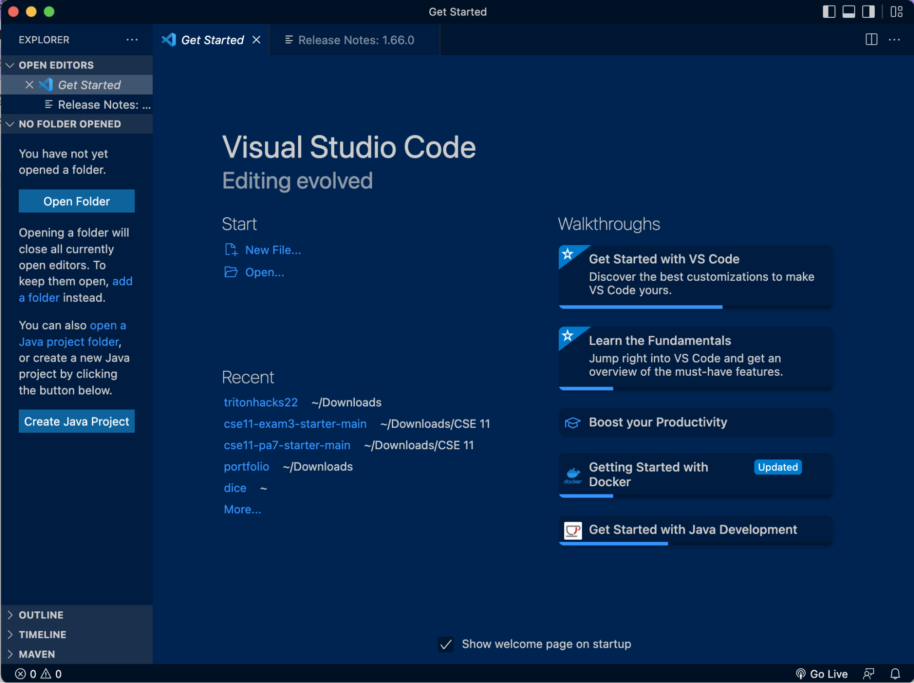
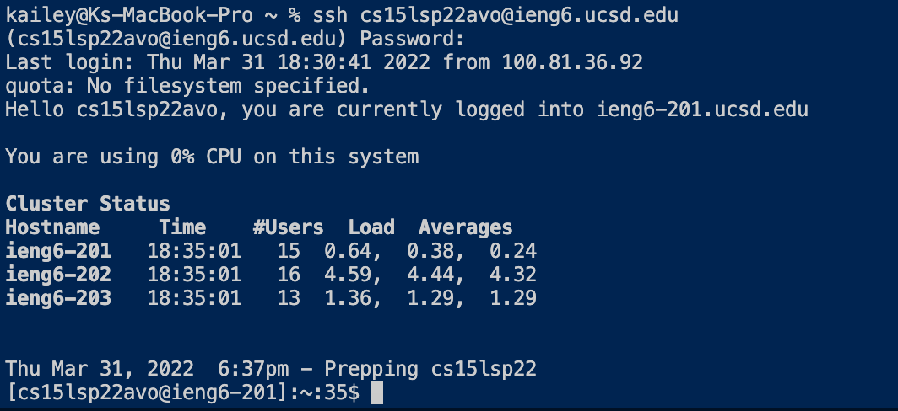
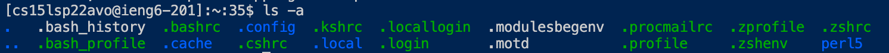
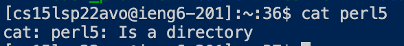
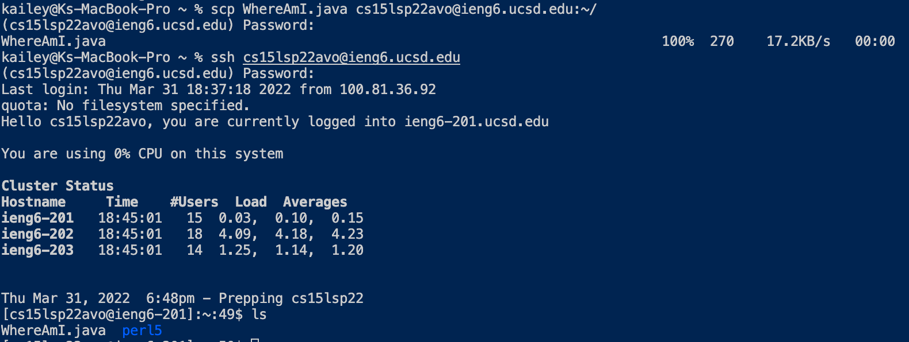
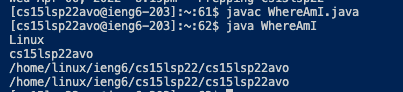
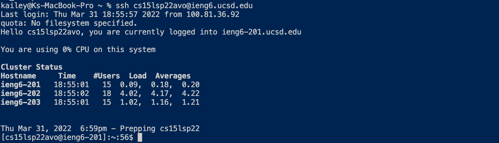
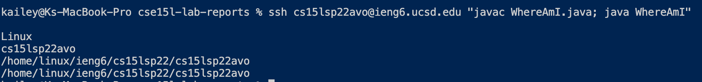

# Lab Report 1

This tutorial will cover remotely connecting to a course-specific ieng6 account using `ssh` and running commands remotely.

Table of Contents:
- [Installing VScode](#installing-vscode)
- [Remotely Connecting](#remotely-connecting)
- [Trying Some Commands](#trying-some-commands)
- [Moving files with scp](#moving-files-with-scp)
- [Setting an SSH key](#setting-an-ssh-key)
- [Optimizing Remote Running](#optimizing-remote-running)
## Installing VScode
Before you get started, make sure to [download](https://code.visualstudio.com/download) Visual Studio Code. Download the version that is appropriate for your operating system. Once the application is running, it should look something like this when first opened:

## Remotely Connecting
### Set up your course-specifc account
Before trying to connect, find your course-specific account and reset the password using the [account lookup tool](https://sdacs.ucsd.edu/~icc/index.php) to ensure you can access the account (it can take 15-60 minutes for the password to reset). 
### Using ssh
Now, open the terminal in VSCode through the menu (Terminal > New Terminal) and enter this command (using your course-specific username): 
`ssh <your course-specific username>@ieng6.ucsd.edu`
When prompted, enter your password then press return (you won't be able to see any of the characters you type, which is normal). Say 'yes' to any prompts to continue donnecting. Once you're logged in, your terminal should look something like this:


## Trying Some Commands
Now, you're ready to try running commands remotely from your computer (called the *client*) on a computer located in the CSE basement (called the *server*). Here are some commands you can try running to find out information about the server and navigate:
- `cd`
- `ls`
- `ls -a`
- `ls -lat`
- `ls <directoryname>`
- `pwd`
- `cat <filename>`

Here are examples of running the commands:



To close your connection to the server, you can use the keyboard shortcut `Ctrl+D` or run the command `exit`.

## Moving files with scp
Now that you've succesfully connected to the server, you can use `scp` (secure copy protocol) to copy files from your computer to the server. On your computer, create a file named 'WhereAmI.java' with the following contents:
```
class WhereAmI {
public static void main(String[] args) {
System.out.println(System.getProperty("os.name"));
System.out.println(System.getProperty("user.name"));
System.out.println(System.getProperty("user.home"));
System.out.println(System.getProperty("user.dir"));
}
}
```
Now, enter the following command to copy the file to the server's home directory:
`scp WhereAmI.java <your account username.@ieng6.ucsd.edu:~/`

Enter your password when prompted, then log into the server again using `ssh` (as a shortcut, you can use the up arrow to find previous commands that have been run). Run the command `ls` to check that the file has been copied to the server, then compile and run the file on the server. It should look something like this:


## Setting an SSH key
In order to skip entering your password each time you use `ssh` or `scp`, you can use `ssh` keys using the `ssh-keygen` command, which creates a pair of public and private keys. 

Enter the command `ssh-keygen`, then when prompted for a file in which to save the key, enter (replacing <username> with your own username) `/Users/<username>/.ssh/id_rsa` and just press `return` twice w

Now, `ssh` into the server and use the command `mkdir .ssh` to create the directory where the public key will be copied to. Log out, then use `scp` to copy the key to the `.ssh` directory you just created: 

`scp /Users/<username>/.ssh/id_rsa.pub <course-specific username>@ieng6.ucsd.edu:~/.ssh/authorized_keys`

Here is an example of using `ssh` after setting up ssh keys:


## Optimizing Remote Running
Now that you don't have to enter your password each time you `scp` or `ssh`, you can optimize running commands remotely from your computer. By using a semicolon `;` between commands, you can enter multiple commands to be run on the same line. For example: `javac WhereAmI.java; java WhereAmI`

Further, when running commands remotely, you can use quotes on the same line, after the `ssh` command, to run the commands on the server. This chaining of commands can save you keystrokes when entering multiple commands.

For example: `ssh <course-specific username>@ieng6.ucsd.edu "javac WhereAmI.java; java WhereAmI'` to run the `javac` and `java` commands on the server. 

This is what running the command would look like:
