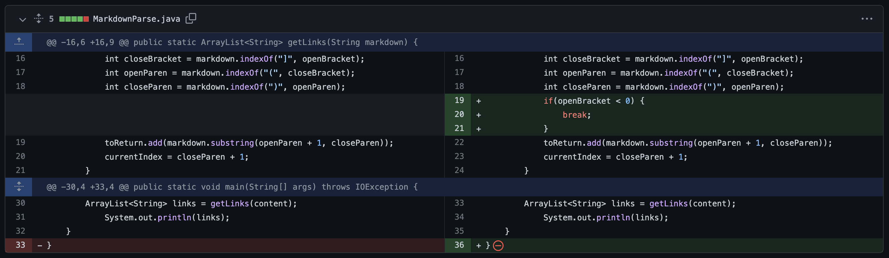
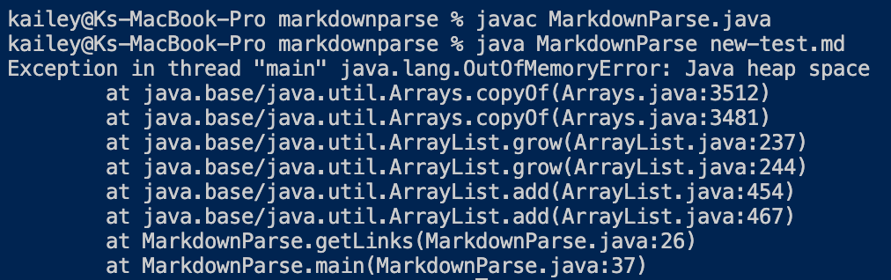
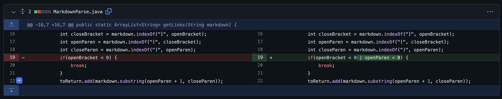
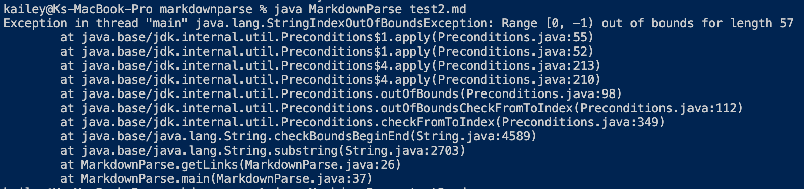
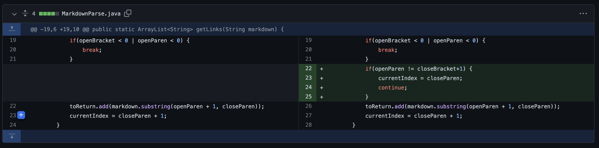

# Lab Report 2

## Failure 1

This is the [file](https://github.com/kaileywong/markdown-parser/blob/main/new-test.md) that was the failure-inducing input that prompted these changes.

The symptom of the bug, an OutOfMemoryError is depicted below:

This symptom occurred because empty lines at the end of the test file caused the `getLinks` method to enter an infinte loop, leading to Java running out of memory. The bug was that the method wouldn't stop of it didn't find a `[` too denote the start of a new link, which caused it to keep going back to the beginning of the file.

## Failure 2

This is the [file](https://github.com/kaileywong/markdown-parser/blob/main/test2.md) that was the failure-inducing input that prompted these changes.

The symptom of the bug, an StringIndexOutBoundsException is depicted below:

This symptom occurred because the `getLinks` method would still try to look for a `(` if there were any `[]` but no actual links in the file. The method would find the index of the `(` to be -1, which caused an OutOfBoundsException when trying to add a nonexistent link to the list of links.

## Failure 3

This is the [file](https://github.com/kaileywong/markdown-parser/blob/main/test3.md) that was the failure-inducing input that prompted these changes.

The symptom of the bug, an incorrect output of `[computer]` when the output should have been empty `[]`, is depicted below:

This symptom occurred because the `getLinks` method did not check if `]` and `(` were right next to each other in the given markdown file. If there were brackets and parenthesis separated by any content, it would still identify any content in the parentheses as a link rather than just skipping it and checking any other potential instances of a link.
