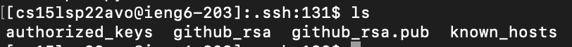

# Lab Report 3

Table of Contents:
- [Streamlining ssh Configuration](#streamlining-ssh-configuration)
- [Setup GitHub Access from ieng6](#setup-github-access-from-ieng6)
- [Copy whole directories with scp -r](#copy-whole-directories-with-scp--r)

## Streamlining `ssh` Configuration
Below are the contents of my `.ssh/config` file, where the account `cs15lsp22avo@ieng6.ucsd.edu` is given the alias `ieng6`:

I edited the contents of this file using the command `cat > config` then inputting the depicted contents.

Using the alias `ieng6`, I can now quickly `ssh` or `scp` into my course account:

## Setup Github Access from `ieng6`
After creating an `ssh` key in my `ineg6` account using `ssh-keygen`, I added it to my GitHub account, where it can be found as displayed:

The `ssh` key is stored in the `.ssh` directory of my `ieng6` account in `github_rsa.pub`:

Now, I am able to commit and push changes to GitHub from my `ieng6` account:

The commiit can be seen [here](https://github.com/kaileywong/skill-demo1/commit/cdf9326a05390ab39d9a19f99017ad758eb6d4b7) on GitHub.

## Copy whole directories with  `scp -r`
Using the command `scp -r`, I was able to recursively copy my entire `markdown-parser` directory to my `ieng6` account:

Now, after logging into my `ieng6` account, I can compile and run the tests:

To further optimize running, the command can be combined to copy and run the tests on the `ieng6` account:
