# Lab Report 4

Table of Contents:
- [Snippet 1](#snippet-1)
- [Snippet 2](#snippet-2)
- [Snippet 3](#snippet-3)

My markdown parse [repository](https://github.com/kaileywong/markdown-parser).

The markdown parse [repository](https://github.com/grantcoz/markdown-parse) my group reviewed.

## Snippet 1
```
`[a link`](url.com)

[another link](`google.com)`

[`cod[e`](google.com)

[`code]`](ucsd.edu)
```
Expected output from CommonMark:
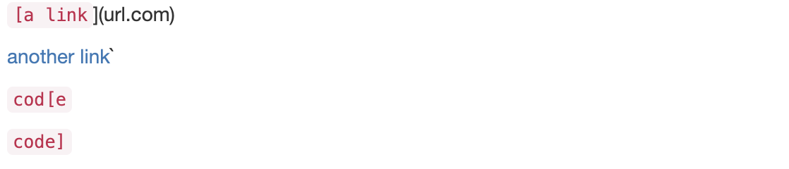

To test this snippet, I created a file `snippet1.md` with the contents above and wrote the following test:
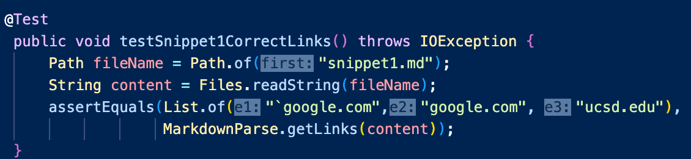

Running the test with my implementation, the test does not pass and produces the following output:
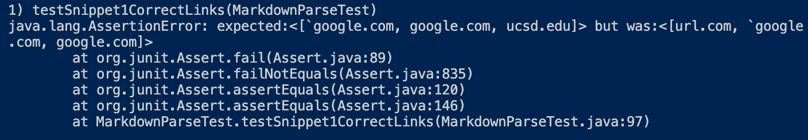

Running the test with the other group's implementation, the test does not pass produces the following output:
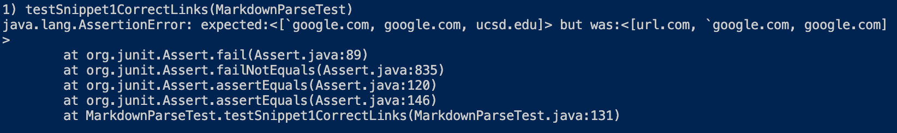

I think a small code change that would make my program work for snippet 1 and all related cases that use inline code with backticks would be to check for opening and closing backticks. If there is an opening backtick before an opening bracket, the content enclosed by backticks should not be treated as a link and skipped. If backticks enclose both opening and closing brackets/parentheses, the enclosed content should not be treated as a link and skipped. Otherwise, contents can be treated like normal characters in a link.

## Snippet 2
```
[a [nested link](a.com)](b.com)
[a nested parenthesized url](a.com(()))
[some escaped \[ brackets \]](example.com)
```
Expected output from CommonMark:
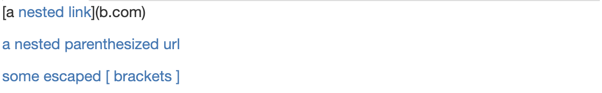

To test this snippet, I created a file `snippet2.md` with the contents above and wrote the following test:
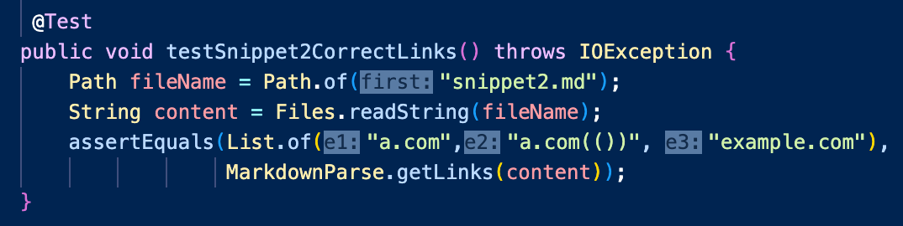

Running the test with my implementation, the test does not pass and produces the following output:


Running the test with the other group's implementation, the test does not pass produces the following output:
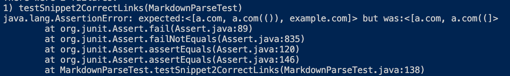

I do not think there is a small code change that would make my program work for snippet 2 and all related cases that nest parentheses, brackets, and escaped brackets; the change would be more involved because it would require checking for pairs of opening and closing brackets or escaped brackets. Escaped brackets would need be treated as normal characters and the escape characters `\` would need to be removed from the output. For nested parentheses and brackets, you would need to determine the indeces of the outermost brackets and/or parentheses and whether these brackets and parentheses are consecutive and are a valid link.

## Snippet 3
```
[this title text is really long and takes up more than
one line

and has some line breaks](
https://www.twitter.com
)

[this title text is really long and takes up more than
one line](
https://sites.google.com/eng.ucsd.edu/cse-15l-spring-2022/schedu
le
)

[this link doesn't have a closing parenthesis](github.com

And there's still some more text after that.

[this link doesn't have a closing parenthesis for a
while](https://cse.ucsd.edu/


)

And then there's more text
```

Expected output from CommonMark:
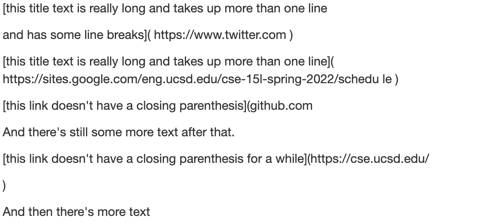

To test this snippet, I created a file `snippet3.md` with the contents above and wrote the following test:
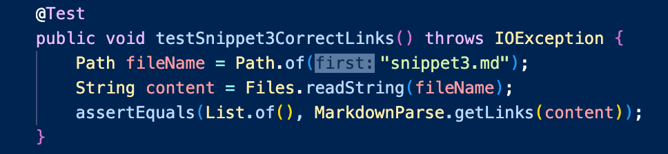

Running the test with my implementation, the test passes and produces the following output:
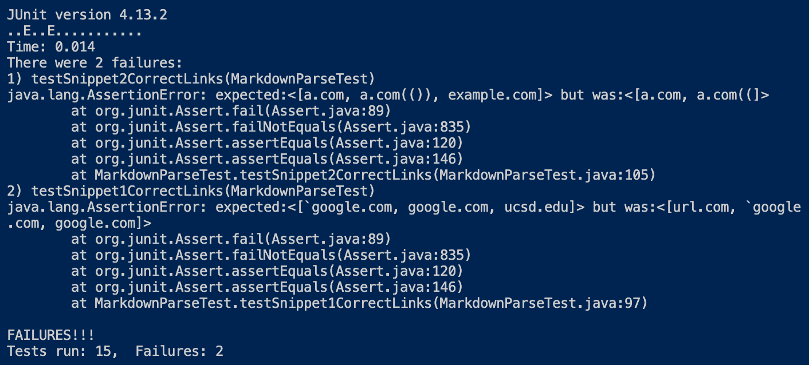

Running the test with the other group's implementation, the test does not pass produces the following output:
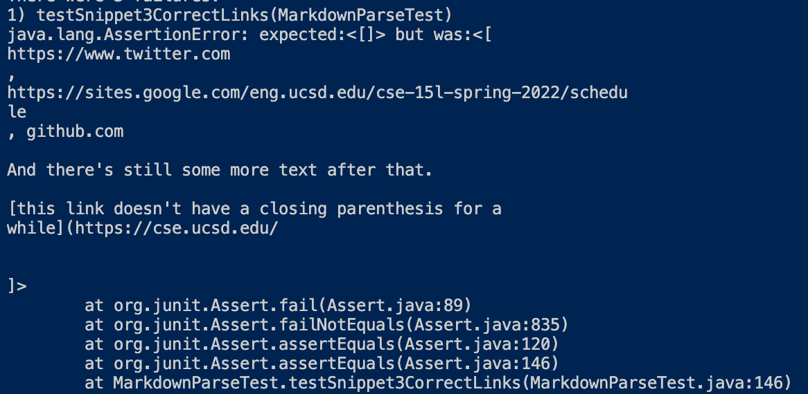

My implementation of MarkdownParse checks for line breaks within links and passes the test for snippet 3. If a line break is found, my code will skip to check the next potential link in the file.