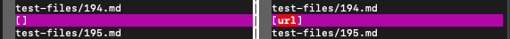
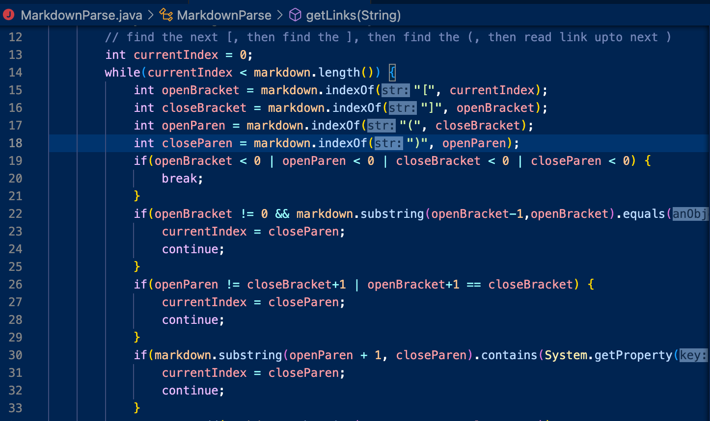

# Lab Report 5

Table of Contents:
- [Test 1](#test-1-194)
- [Test 2](#test-2-22)

To find the tests with different results, I used `vimdiff` to compare the results of running a bash script on both my implementation and the provided implementation. The bash script used a for loop to cycle through all of the files in the `test-files` folder.

## Test 1 (#194)
[Test-file 194](https://github.com/nidhidhamnani/markdown-parser/blob/main/test-files/194.md)

The differing results are depicted below (my implementation is on the left, the provided implementation is on the right):

Neither implementation was correct. The output for my implementation was no links and the output for the provided implementation was `url`.

Expected output (using CommonMark): `my_(url)`

For the my implementation, the code could be fixed by checking for colons after a closing bracket which indicates that content after is a reference link. The code should also check for link titles, which are indicated by opening nd closing quote characters. If a link title is found, this portion should be ignored when parsing the links.

## Test 2 (#22)
[Test-file 22](https://github.com/nidhidhamnani/markdown-parser/blob/main/test-files/22.md)

The differing results are depicted below (my implementation is on the left, the provided implementation is on the right):

Neither implementation was correct. The output for my implementation was `/bar\* "ti\*tle"` and the output for the provided implementation was no links.

Expected output (using CommonMark): `/bar*`

For the provided implementation, the code could be fixed by checking for escape characters and link titles in the potential link. Link titles are indicated by opening and closing quote characters. If a link title is found, this portion should be ignored, and any escape characters that are found should be ommitted from the output.
